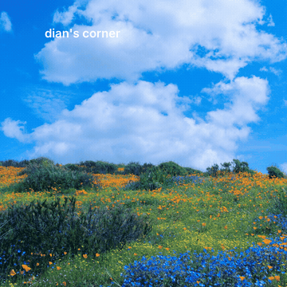
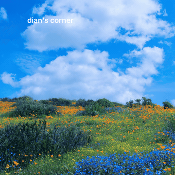
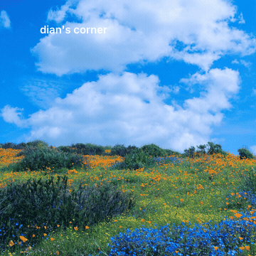

# liquid-glass-lab

A small frontend study of liquid-glass UI materials — transparent panels that
refract the backdrop, built with SVG displacement filters and `backdrop-filter`.
Three material treatments on the same dropdown nav, over the same background,
with the same open/close animation. Only the glass changes.

> **Chromium only.** `backdrop-filter: url(#filter)` is not supported in Safari
> or Firefox, so the refraction renders in Chrome / Edge.

## Material demos

| Soft Frost | Edge Lens | Thick Crystal |
| --- | --- | --- |
|  |  |  |

- **Soft Frost** — a soft, even haze across the panel.
- **Edge Lens** — a clear center with refraction at the rim, like a true lens.
- **Thick Crystal** — a heavier edge with corner gloss and caustics.

## Run

Open any file in Chrome, or serve the folder locally:

```bash
python3 -m http.server 8766
```

- `nav-dropdown.html` — Soft Frost
- `nav-dropdown-edge-lens.html` — Edge Lens
- `nav-dropdown-thick-glass.html` — Thick Crystal
- `showcase.html` — all three side by side
- `glass-nav.html` — the web component demo

## Web component

`glass-nav.js` packages the nav as a `<glass-nav>` custom element:

```html
<script src="glass-nav.js"></script>
<glass-nav material="edge-lens" label="dian's corner">
  <a href="#writing">Scribbles</a>
  <a href="#log">Tinkering</a>
  <a href="#now">Up to</a>
  <a href="#contact">Knock knock</a>
</glass-nav>
```

- `material` — `soft-frost` | `edge-lens` | `thick-crystal`
- `label` — the trigger text
- menu items — `<a>` children
- `open` — start expanded; `--glass-nav-trigger-size` / `--glass-nav-item-size` tune the type

Keyboard, ARIA, and outside-click handling are built in, and the whole thing is
shadow-DOM encapsulated.

## How it works

Each panel applies an SVG filter as a `backdrop-filter`:

- **Displacement map.** Soft Frost uses `feTurbulence` for a full-surface swirl.
  Edge Lens and Thick Crystal use a structured gradient map that keeps the
  center clear and concentrates the bend at the edge.
- **Chromatic fringe.** Three displacement passes at slightly different scales,
  one per color channel, recombined with `feBlend`.
- **Open / close.** A `clip-path` reveal plus opacity — the filtered layer never
  transforms during the animation, so the refraction stays stable.

## Note

This is a backdrop refraction, so it works best on chrome surfaces — navigation,
tabs, card shells — rather than directly over body text that must stay legible.
